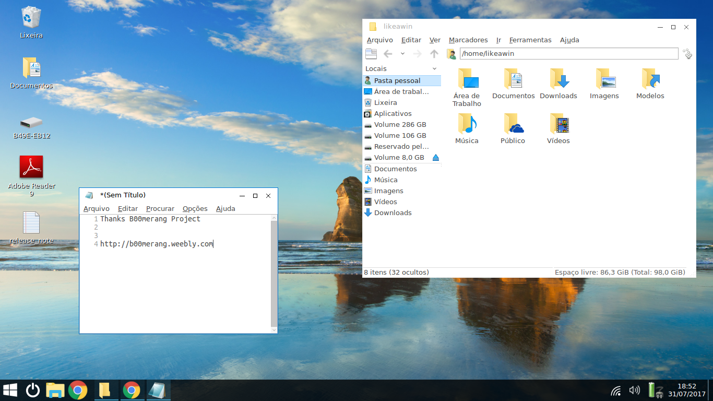
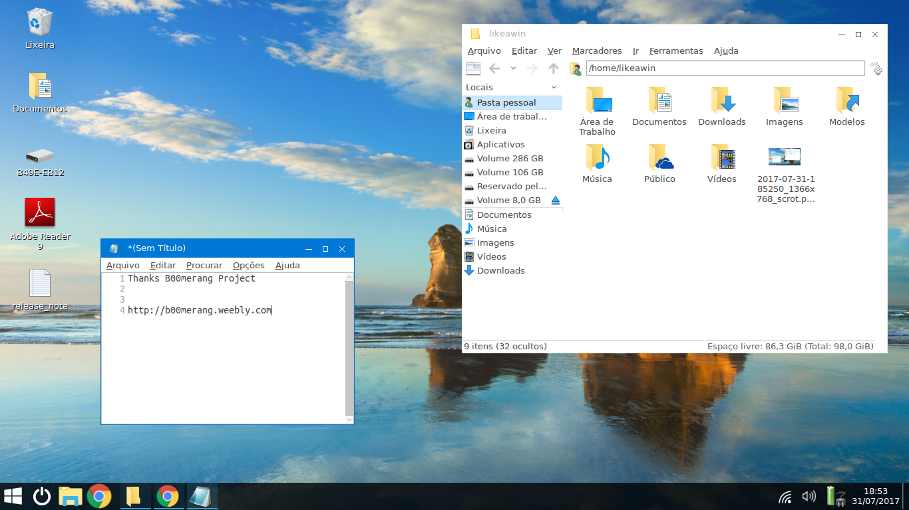

# Windows 10 Theme for Lubuntu 16.04 LTS

This is an fork of B00merang Project with my modifications

**Distributor :** [B00merang Theming](https://github.com/B00merang-Project)

**License :** GPL v3

For the moment, this theme works with the following Desktop environments : 
- Cinnamon 2.4/2.6/2.8/3.0/3.2
- GNOME-SHELL 3.14/3.16/3.18/3.20/3.22
- XFCE 4.x
- MATE 1.8/1.10/1.12 and greater
- LXDE 0.8/0.10 and greater
- KDE Plasma 5 (KDE 4 has some issues)
- Unity 7.x
- Openbox 3
- Fluxbox
